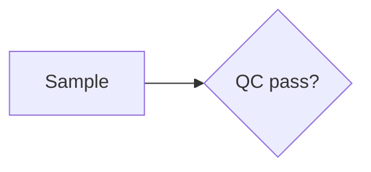

# Lumen 1.0

Lumen is Markdown for research writing. It adds the five things academic prose
actually needs — mathematics, typed blocks, automatic numbering,
cross-references and citations — and nothing else.

Files use the extension `.lmd`. Every Lumen document is also a valid Markdown
document: anything a plain viewer doesn't understand degrades to readable text
rather than visible noise. That constraint decides every syntax question below.

Lumen is CommonMark plus GitHub-flavoured Markdown (tables, task lists,
strikethrough, autolinks) plus the five extensions in §2–§6.

---

## 1. Frontmatter

YAML between `---` fences, the first thing in the file. Every field is optional.

```yaml
---
title: Drift-corrected estimation in retrospective cohorts
subtitle: A bound on ascertainment bias under time-varying capture
authors:
  - name: K. Jaiswal
    affiliation: HealthBay Research
date: September 2026
citationStyle: numeric          # numeric | author-year
numbering:
  theorem: section              # continuous | section | off
  figure: continuous
  table: continuous
  equation: labeled             # all | labeled | off
  theoremStyle: shared          # shared | per-type
macros:
  R: '\mathbb{R}'
toc: true
lang: en
---
```

`authors` accepts plain strings or objects with `name`, `affiliation`, `email`
and `orcid`. `macros` are TeX macros available to every equation in the
document; write them in single quotes so YAML leaves the backslashes alone.

## 2. Blocks

```
::: theorem "Cauchy–Schwarz" {#thm:cs}
$$ |\langle x,y\rangle| \le \|x\|\,\|y\| $$
:::
```

The general form is `::: <kind> ["title"] [{#id .class key=value}]`, with
Markdown inside and `:::` to close. The space after `:::` is optional, and
blocks nest by using more colons (`::::`).

| Group | Kinds | Numbered |
| --- | --- | --- |
| Theorem-like | `theorem` `lemma` `corollary` `proposition` `definition` `example` `remark` `conjecture` `axiom` | yes |
| Proof | `proof` | no — closes with ∎ |
| Captioned | `figure` `table` | yes |
| Callouts | `note` `tip` `warning` `important` `caution` | no |
| Other | `abstract` `aside` `equation` `bibliography` | `equation` only |

An `aside` is set in the margin when the page is wide enough, and falls inline
below that. In a `figure` or `table` holding more than one thing, the last
paragraph is the caption:

```
::: figure {#fig:pipeline}

The acquisition path.
:::
```

An unrecognised kind renders as a plain container and reports a warning; its
content is never dropped.

## 3. Mathematics

`$…$` inline and `$$…$$` for display, with `\(…\)` and `\[…\]` also accepted.
Rendered with KaTeX. A `$` that isn't delimiting math — `$5 and change` — is
left alone.

Label a display equation with an attribute block on the closing line:

```
$$
J = -D \,\nabla \phi
$$ {#eq:flux}
```

Under the default `equation: labeled`, only labelled equations are numbered, so
working notes don't consume numbers. Set `equation: all` to number every
display equation.

## 4. Numbering

Counters advance in document order.

- `continuous` counts through the whole document: Figure 1, Figure 2, …
- `section` restarts at each top-level heading: Theorem 2.1, Theorem 2.2, …
- `off` disables numbering for that kind.

The section level is the shallowest heading depth the document actually uses,
so a paper written with `#` headings and one written with `##` both behave.

`theoremStyle: shared` (the default) draws theorem-like blocks from one
counter — Theorem 1, Lemma 2, Definition 3 — which is the AMS convention.
`per-type` gives each kind its own.

## 5. Cross-references

`@prefix:name` resolves to a typed, numbered link.

| Written | Rendered |
| --- | --- |
| `@thm:cs` | Theorem 2.1 |
| `-@thm:cs` | 2.1 |
| `@eq:flux` | Eq. (7) |
| `@fig:a,fig:b` | Figures 1 and 2 |
| `@sec:intro` | Section 3 |

The kind label comes from the thing being referenced, not from the prefix, so
`@x:cs` would still say "Theorem" if `x:cs` is a theorem. The prefix is a
convention that keeps documents readable, not a rule.

Headings take an id the same way: `## Introduction {#sec:intro}`. Headings
without one get a slug, which works as an anchor but isn't meant to be cited.

A reference must have its `@` at the start of a line or after whitespace or
punctuation, and must match `@[a-z]+:[A-Za-z0-9_-]+`. That leaves email
addresses and social handles untouched. Write `\@` for a literal at-sign.

An unresolved reference renders visibly as `?@thm:cs` and reports an error. It
is never silently dropped — a missing cross-reference in a paper is a mistake
worth seeing.

## 6. Citations

Citation keys have no colon, which is what distinguishes them from
cross-references.

| Written | numeric | author-year |
| --- | --- | --- |
| `[@fick1855]` | [1] | (Fick, 1855) |
| `[@a; @b]` | [1, 2] | (Adams, 1990; Bell, 2004) |
| `[@fick1855, p. 33]` | [1, p. 33] | (Fick, 1855, p. 33) |
| `@fick1855` | Fick [1] | Fick (1855) |

The bibliography comes from a fenced ```` ```bibtex ```` block anywhere in the
document — the fence itself never renders — or from the `bib` frontmatter
field. A `::: bibliography` block places the reference list; without one it is
appended under a `References` heading.

An unknown key renders as `[?key]` and reports an error.

## 7. Diagrams

Fenced ```` ```mermaid ```` blocks. Attach an id on the info string
(```` ```mermaid {#fig:pipeline} ````) or wrap the fence in a `::: figure` to
give it a caption and a number.

The compiler does not render diagrams; it emits a placeholder carrying the
source, and the renderer draws it. That keeps Mermaid — half a megabyte of it —
out of documents that have no diagrams.

## 8. Diagnostics

The compiler never throws on document content. Problems come back as a list of
`{severity, ruleId, message, line, column}` alongside a best-effort render.

| ruleId | Meaning |
| --- | --- |
| `frontmatter-invalid` | The YAML block didn't parse |
| `unknown-block` | `::: something` isn't a Lumen kind |
| `invalid-id` | An id has characters that can't appear in a link |
| `duplicate-id` | Two things claim the same id |
| `xref-unresolved` | `@x:y` points at nothing |
| `citation-unknown` | No bibliography entry for a key |
| `unsupported-directive` | A leaf directive was passed through as text |
| `highlight-failed` | A code block couldn't be highlighted |
| `math-invalid` | A formula could not be rendered |
| `math-strict` | KaTeX accepted a formula but flagged it as questionable |

## 9. Output

The compiler returns a [hast](https://github.com/syntax-tree/hast) tree, not an
HTML string, so a renderer can diff it and no consumer needs
`dangerouslySetInnerHTML`.

Class names are part of the public contract and will not change within 1.x:

```
lmn-doc         lmn-title        lmn-abstract
lmn-block       lmn-block__head  lmn-block__label  lmn-block__title
lmn-theorem     lmn-theorem--<kind>
lmn-proof       lmn-proof__end
lmn-callout     lmn-callout--<kind>   lmn-callout__head
lmn-figure      lmn-figure__body      lmn-caption   lmn-caption__label
lmn-aside       lmn-eq           lmn-eq__number
lmn-xref        lmn-xref--broken      lmn-xref-group
lmn-cite        lmn-cite__ref         lmn-cite--broken
lmn-bib         lmn-bib__list         lmn-bib__entry    lmn-bib__marker
lmn-diagram     lmn-code       lmn-tie
```

Every top-level element carries `data-line` (the source line it came from) and
`data-block` (its index), which is what editors use for scroll sync.

## 10. Security

Document text is untrusted. The tree is sanitised before KaTeX and the
syntax highlighter contribute their own markup, so neither has to be
whitelisted. Literal HTML in the source is stripped unless `allowRawHtml` is
set, and even then it passes through the same sanitiser. Link protocols are
limited to `http`, `https`, `mailto` and `#`. Mermaid runs with
`securityLevel: 'strict'`.

## 11. Relationship to other formats

[MyST](https://mystmd.org) covers similar ground. Lumen differs by trading
compatibility for typing speed: `::: theorem` and `@thm:cs` can be written
without consulting documentation, where MyST's `{directive}` and
`` {role}`x` `` forms are shaped by Sphinx. If you need the Jupyter Book
toolchain, use MyST. If you want to write a paper quickly and read it well,
use this.
